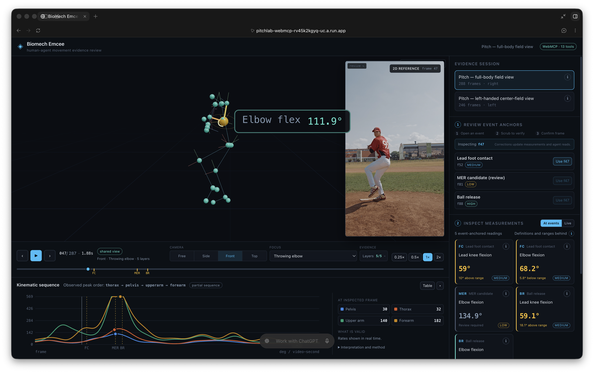

# Biomech Emcee

**Shared 3D movement review for people and agents, powered by WebMCP.**

[Live application](https://pitchlab-webmcp-rv45k2kgyq-uc.a.run.app) ·
[2:47 demo video](https://www.youtube.com/watch?v=GgpMeqoZfM4) ·
[Development and inference guide](DEVELOPMENT.md) ·
[Attribution and licenses](ATTRIBUTION.md)

For the judge review, open the live application in **ChatGPT’s in-app browser**. **Quick-start
prompts** is visible below the header: “Show me the elbow angle when the front foot lands.” Select
**2 more prompts** for a human foot-contact correction and a shared frame-linked note. These are
examples, not a prescribed script—use your own words and questions.
The demo was recorded in ChatGPT’s in-app browser; native tools were also verified in
Chrome for Testing 154. No app login or local setup is required for the included sessions.

Biomech Emcee is a WebMCP-native movement-evidence workspace where a person and an AI agent inspect
and operate the same live biomechanics session. Baseball pitching is the implemented reference
workflow: synchronized source video and a 3D reconstruction are presented with phase events,
bounded measurements, confidence, references, comparison limits, and persistent notes.

This is not a dashboard with a chatbot attached. The browser exposes its live review state through
13 imperative WebMCP tools. Nine tools let an agent read the active session, events, measurements,
definitions, series, sequence, references, and comparison limits. Four write tools visibly seek the
timeline, focus anatomy, change evidence overlays, and add frame-linked notes to the workspace the
human is already using.



The demo and hero capture show the same review tools and evidence before the optional Quick-start
guide was added. The guide changes discoverability, not the analysis or tool capabilities.
[See the current Quick-start guide](assets/biomech-emcee-quick-start.png).

## Why WebMCP

The useful context in specialist software is often transient and visual: which session and frame is
open, what anatomy is selected, which layers are visible, and what the reviewer corrected. Without
WebMCP, an external agent must guess through pixels or DOM interactions, or work from a separate
backend representation that does not match the human's current view.

Biomech Emcee gives the agent a typed, bounded interface to the same browser state:

- A casual question can become a precise event, joint, camera view, and visual explanation.
- An agent can navigate to evidence and leave a persistent note for a human reviewer.
- A human event-frame correction immediately changes subsequent agent reads.
- Two sessions can be compared descriptively while better/worse ranking remains unavailable.
- Unsupported requests—such as elbow torque, ground-reaction force, pitch velocity, or injury
  risk—return structured refusals instead of plausible-looking numbers.

The website owns domain evidence and valid actions; the connected agent contributes language and
reasoning; the human retains judgment.

## What is implemented

- Synchronized source-video and interactive Three.js 3D skeleton review.
- Timeline, event anchors, anatomical camera planes, focus controls, and evidence overlays.
- Application-owned elbow/knee flexion geometry grounded in reconstructed landmarks.
- Human correction of foot contact, maximum external rotation, and ball-release frames.
- Browser-side biomechanics analysis with confidence, citations, and explicit limitations.
- Partial four-segment peak-order display, never presented as force transfer or a quality score.
- Exactly 13 WebMCP tools: nine read and four write.
- Two licensed, precomputed sessions that run without a GPU or backend.

Baseball pitching is the only implemented domain workflow. Supporting another sport would require
its own events, measurements, references, interface review, and validation.

## Architecture

```text
licensed source video
  → offline Python pipeline: person detection + SAM 3D Body
  → session JSON with 2D/3D landmarks
  → static React/Three.js browser workspace
      ├─ browser-side bounded biomechanics analysis
      ├─ one Zustand store shared by UI and tools
      └─ 13 document.modelContext.registerTool definitions
            ↕
         human and agent operate one evidence surface
```

Heavy reconstruction is offline. The deployed application is a static Vite build served by nginx;
it loads the committed sessions and performs the review analysis in the browser.

## Included data

The exact judge-facing inputs and generated payloads are already committed:

```text
web/public/sessions/
  delivery-02.mp4   # Pexels licensed reference video
  delivery-02.json  # SAM 3D Body-derived session payload
  delivery-03.mp4   # CC BY-SA 4.0 Wikimedia derivative
  delivery-03.json  # SAM 3D Body-derived session payload
  index.json        # public session manifest
```

The MP4 files are the synchronized inputs shown by the app; the JSON files contain the smoothed 2D
and 3D landmark trajectories used by the browser analysis. Creator, source, license, modification,
and model terms are documented in [ATTRIBUTION.md](ATTRIBUTION.md) and shown inside the application.

Model checkpoints are not included. They are gated and remain under Meta's SAM License. Raw working
clips, vendored upstream source, uploaded clips, and QA intermediates are intentionally local-only.

## Quick start: review the included sessions

Prerequisites: Node.js 24+ and npm.

```bash
cd web
npm ci
npm run dev
```

Open the Vite URL. No Python environment, GPU, model checkpoint, login, or backend is needed.

Verify the project with:

```bash
cd web
npm run typecheck
npx vitest run
npm run build
```

The release baseline is 93 passing tests plus a clean typecheck and production build.

For complete environment setup, gated model download, video-to-3D inference, local upload analysis,
data layout, and deployment instructions, see [DEVELOPMENT.md](DEVELOPMENT.md).

## Scientific boundary

Biomech Emcee is a review and evidence-navigation system—not a diagnostic system, injury predictor,
autonomous coach, medical device, or validated replacement for marker-based motion capture. The
monocular reconstruction uses camera-frame coordinates with estimated focal length. It cannot
establish kinetics or absolute metric distances.

Only construct-compatible direct two-segment elbow and lead-knee flexion measurements are compared
with published ranges. Other displayed angles are exploratory. The two bundled sessions show
different athletes and capture conditions, so their differences are descriptive only and cannot
support improvement, regression, performance, or causal claims.

## License

Biomech Emcee source code is released under the [MIT License](LICENSE). The bundled videos retain
their own Pexels and CC BY-SA 4.0 terms. SAM 3D Body code and checkpoints remain under their upstream
terms and are not redistributed here. See [ATTRIBUTION.md](ATTRIBUTION.md).

The demo voiceover uses Kokoro v1.0 (`af_heart`), synthesized locally. This is presentation-only AI
usage, not a speech feature or dependency of the application.
